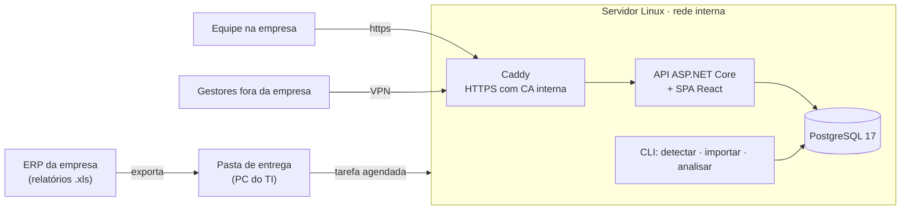

# SmartStock AI

**Plataforma de gestão inteligente de estoque e redistribuição entre lojas**, desenvolvida para a rede de lojas **Dorémi Brinquedos** (lojas físicas, e-commerce e um depósito central). Lê os relatórios do ERP da empresa exatamente como eles saem, mostra onde falta e onde sobra produto em cada loja e recomenda **o que transferir, de onde para onde e quanto**, sempre com o motivo e os números usados.

> O sistema recomenda. O usuário decide. O sistema registra.
> Nenhuma recomendação movimenta estoque: a decisão e a operação continuam com as pessoas.

Em produção num servidor da própria empresa, sem exposição na internet.

**Autor:** Jonathan Alves Ribeiro, Técnico de TI na Dorémi Brinquedos · [Sobre mim e currículo](SOBRE-MIM.md) · [LinkedIn](https://www.linkedin.com/in/jonathan-alves-ribeiro-95596a303)

    

---

## O problema

- Os relatórios do ERP (estoque, vendas e transferências) eram exportados e **tratados à mão** em planilhas, um por um.
- Não havia **visão da rede**: cada loja era olhada separadamente, então um produto podia estar parado numa loja enquanto faltava em outra.
- Transferências eram decididas pela experiência, **sem registro do motivo** nem conferência se aconteceram.
- **Estoque negativo** acumulava sem que se soubesse onde, quanto e por quê.

## A solução

| Área | O que a plataforma faz |
|---|---|
| **Entrada de dados** | Lê os arquivos do ERP **sem tratamento** (Excel 4.0, .xls, .xlsx, .csv). Descobre o tipo de cada planilha **pelas colunas**, não pelo nome do arquivo; reconhece a loja pelo nome, mesmo abreviado ou com erro de digitação ("PINDA", "SHOPPINH BURITI"). Valida tudo antes de gravar e mostra um relatório de erros. |
| **Automação** | Uma **pasta de entrega**: soltou a planilha, em poucos minutos ela é enviada ao servidor, importada e a análise é recalculada, com aviso na tela. Sem senha guardada. |
| **Análise** | Cobertura em dias por produto e loja, ruptura, excesso, produto parado e estoque projetado (desconta a venda dos dias desde a foto do estoque). |
| **Recomendação** | Sugestões de transferência agrupadas por **rota** (uma carga de origem → destino), com quantidade, motivo e dados dos dois lados; sugestões de compra para o que a rede não cobre. Aprovação e rejeição em lote, com conferência automática de quando a transferência aparece no ERP. |
| **Alertas** | Comparando com a análise anterior: venda diária sem reposição, previsão de ruptura, queda brusca de estoque (descontando o que saiu por transferência), sobra numa loja e falta em outra, marca mal distribuída. "Já vi" persistente entre análises e resumo opcional por e-mail. |
| **Estoque negativo** | Painel por loja com tendência, causas prováveis (transferência não recebida, venda sem entrada de nota, código duplicado…) e Excel para correção no ERP. |
| **Vendas por dia** | Do relatório de vendas detalhado: valor, cupons, ticket médio e peças por venda contra o período anterior, produtos vendidos por loja e dia e, para cada produto, **as vendas que formaram o número** (cupom, preço, documento fiscal, balcão ou cliente cadastrado). |
| **Relatórios** | Relatório mensal (análise atual × anterior, precisão das transferências) e mais 9 relatórios, em Excel, CSV e PDF. |
| **Assistente** | Perguntas em português ("ruptura na loja 06", "negativos da marca X") respondidas com as mesmas consultas das telas, por regras, sem custo de IA. |

## Desempenho e qualidade

| | |
|---|---|
| Importação de estoque (planilha Excel 4.0 com dezenas de milhares de linhas e uma coluna por loja) | segundos |
| Gravação em lote | `COPY` binário do PostgreSQL |
| Testes automatizados | 151 no backend (unidade + integração com PostgreSQL real) e 46 no frontend |

## Arquitetura



**Backend** (Clean Architecture enxuta):

```
backend/src
├── SmartStock.Domain          Entidades e regras puras: classificação do estoque, planejador de transferências,
│                              regras de alertas e de estoque negativo (testáveis sem banco)
├── SmartStock.Application     Contratos dos casos de uso e DTOs
├── SmartStock.Infrastructure  EF Core + Npgsql, importações, análise, relatórios, e-mail, identidade
└── SmartStock.Api             Controllers, exportações (Excel), CLI e o host da SPA
```

**Frontend**: React 19 + TypeScript + Vite, TanStack Query, Tailwind CSS v4 e um Design System próprio (cartões, tabelas, gráficos acessíveis, tema claro e escuro).

## Decisões técnicas que valem destacar

- **Importação sem tratamento.** Cada importador declara o layout que reconhece; um comando `detectar` pergunta a cada um se a planilha é dele. O mesmo relatório pode chegar tratado à mão ou bruto do ERP, e os dois funcionam. Arquivo cortado no limite de 65.535 linhas do Excel antigo é recusado, para nunca gravar dados pela metade.
- **Carga em lote rápida.** Gravação com `COPY ... FROM STDIN (FORMAT BINARY)` do Npgsql; reimportar um período substitui só aquele período e aquela loja.
- **Regras de negócio no domínio.** Classificação (crítico < 7 dias, mínimo 15, ideal 30, excesso > 120), venda mínima para sugerir, Depósito como primeira origem, loja com estoque negativo nunca é origem, origem nunca fica abaixo do ideal. Tudo em classes puras, cobertas por testes de unidade.
- **Humano no controle.** Recomendações e alertas nunca executam nada; aprovar só registra a decisão. Toda ação relevante vai para a auditoria (usuário, data, IP e dados afetados).
- **LGPD.** O relatório de vendas do ERP traz nome de cliente e vendedor: são descartados na importação. O sistema guarda só se o cliente era "balcão" ou "cadastrado".
- **Segurança.** Sem exposição na internet: HTTPS com autoridade certificadora interna, acesso só pela rede da empresa ou por VPN. Login com e-mail corporativo, bloqueio após tentativas erradas, JWT de curta duração em memória, refresh token em cookie HttpOnly com rotação e detecção de reuso. Automações sem senha guardada e com o mínimo de permissão necessário.
- **Publicação sem senha.** Um comando compila interface e API (linux-x64, self-contained), gera o executável de migrações (`efbundle`), faz backup do banco, troca a versão de forma atômica e confere o `/api/health`, mantendo as 3 últimas versões para voltar atrás.

## Tecnologias

- **Backend:** .NET 10, ASP.NET Core, EF Core 10 + Npgsql (snake_case), ASP.NET Identity, ClosedXML, ExcelDataReader, xUnit + WebApplicationFactory
- **Frontend:** React 19, TypeScript 7, Vite 8, TanStack Query, React Router 8, Tailwind CSS v4, Vitest + Testing Library
- **Infra:** Linux, Caddy, systemd, PostgreSQL 17, backup automático

## Como rodar localmente

Pré-requisitos: .NET SDK 10, Node.js LTS e PostgreSQL 17.

```powershell
# 1. Bancos, usuário de banco e segredos (connection string e chave JWT em user-secrets, fora do projeto)
powershell -ExecutionPolicy Bypass -File ".\scripts\configurar-ambiente-dev.ps1"

# 2. API em http://localhost:5080 (aplica as migrações e cria o Administrador inicial)
dotnet run --project backend/src/SmartStock.Api

# 3. Interface em http://localhost:5173
cd frontend
npm install
npm run dev
```

Em desenvolvimento os e-mails não saem de verdade: o convite do Administrador inicial fica em `backend/src/SmartStock.Api/emails-dev/` e o link também aparece no terminal da API.

### Testes

```powershell
dotnet test backend      # unidade + integração (banco smartstock_tests, recriado a cada execução)
cd frontend; npm test     # componentes, telas, regras de senha e cliente da API
```

---

## Como foi construído

Requisitos, regras de negócio, decisões, infraestrutura (servidor, rede, VPN, backup e automações) e validação com os dados reais: Jonathan Alves Ribeiro. O código foi desenvolvido com apoio de IA (Claude Code), sob a direção dele.

Código publicado para fins de portfólio, com autorização da Dorémi Brinquedos. Os dados da empresa (planilhas, documentos internos e configurações do servidor) não fazem parte deste repositório. Todos os direitos reservados.
